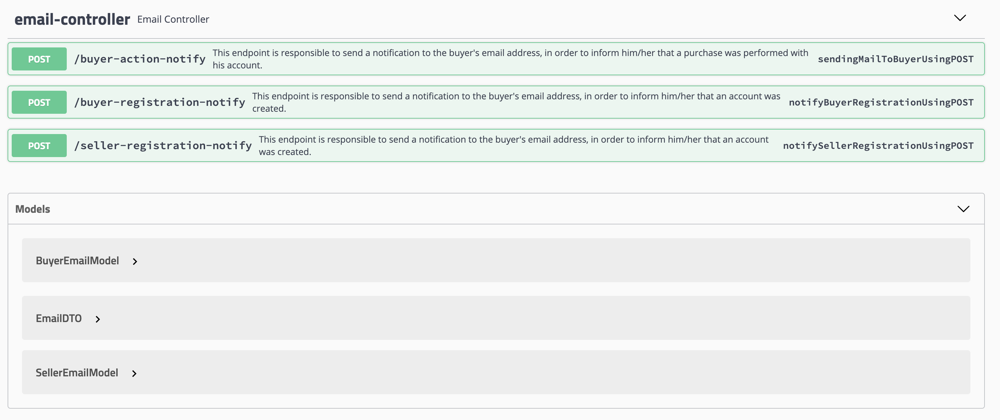

<div id="top"></div>
<!--
*** Thanks for checking out the Best-README-Template. If you have a suggestion
*** that would make this better, please fork the repo and create a pull request
*** or simply open an issue with the tag "enhancement".
*** Don't forget to give the project a star!
*** Thanks again! Now go create something AMAZING! :D
-->


<!-- PROJECT SHIELDS -->
<!--
*** I'm using markdown "reference style" links for readability.
*** Reference links are enclosed in brackets [ ] instead of parentheses ( ).
*** See the bottom of this document for the declaration of the reference variables
*** for contributors-url, forks-url, etc. This is an optional, concise syntax you may use.
*** https://www.markdownguide.org/basic-syntax/#reference-style-links
-->

<!-- PROJECT LOGO -->
<br />
<div align="center">
  <h2 align="center">PomboCorreioAPI</h2>
</div> 

### Sobre esse projeto
Esse projeto foi criado como complemento ao projeto final proposto durante o Bootcamp da Digital House em parceria com o MercadoLivre.
A elaboração deste projeto tem como objetivo criar uma nova funcionalidade que possibilite o envio de notificações via email, como um microserviço, para novos compradores e vendedores no momento do cadastro de suas conta, e também quando realizarem compras em nosso marketplace.

Palavras-chave: email, notificação, microserviços, API, usuário, compra, cadastro.

#### Observação: o email melifrescosemail@gmail.com não tem relação formal com nenhuma empresa pertencente ao grupo MercadoLivre!

<!---
### Coverage


-->

## Atenção!
### Para executar esse projeto, é recomendado clonar a API principal do projeto que se encontra em:
- https://github.com/mateusvictor/Projeto-Integrador-Meli/tree/requisito6/luiz

### Links
* [Link do User Story](./doc/Requisito6Luiz.pdf)
* [Collections Postman](./doc/EmailNotificationRequests.postman_collection.json)


### Tabelas criadas


### Swagger



### Controller principal
O controller principal desse requisito é `EmailController.java`. Esse controller será acessado através de requisições partindo da nossa API principal, linkado anteriormente.

### Observações
- Os arquivos de testes unitários e de integração foram criados na API externa. Logo, essa API de marketplace não terão testes que levem em consideração o envio de emails.
- Esse projeto será aprimorado com o tempo, uma vez que no estado atual, não realiza verificações de segurança. Além de melhorias no código, será implementado o uso de um serviço de fila para organizar a forma que as notificações chegam na aplicação.

---
### Equipe Programming Gang
1. Gustavo Barretto
2. Jessica Kopps
3. Rodrigo Paczkovski
4. Vinícius Coelho
5. Mateus Silva
6. Caio Motta
7. Luiz Felipe Rosa

---
### Tecnologias e recursos utilizados

* [Java](https://www.java.com/pt-BR/)
* [Spring & SpringBoot & SpringWeb](https://spring.io/)
* [Swagger](https://swagger.io/)
* [Maven](https://maven.apache.org/)
* [Lombok](https://projectlombok.org/)
* [JUnit](https://junit.org)
* [Spring Test & Spring Boot Test](https://spring.io/)
* [Mockito](https://site.mockito.org)
* [JWT](https://jwt.io/)
* [JavaMailSender](#)

---
<!-- GETTING STARTED -->
### Utilizando a aplicação
- Pré-requisito
  - É necessário a instalação e o JDK de no mínimo 11.    
<br> 

- Para a instalação do projeto, é necessário realizar um clone do seu repositório.


1. Clone o repo
   ```sh
   git clone https://github.com/luizfelipers19/PomboCorreioAPI.git
   ```
2. Instale Maven packages
   ```sh
   cd PomboCorreioAPI
   mvn install
   ```
3. Crie o pacote target
   ```sh
   mvn package
   ```
4. Acesse a pasta target e execute o .jar
    

---

